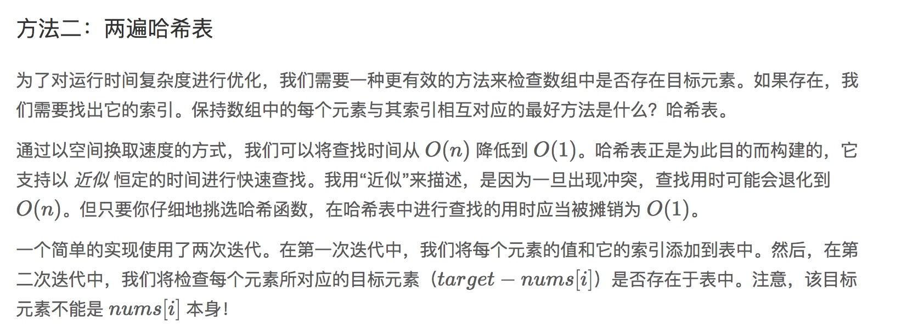
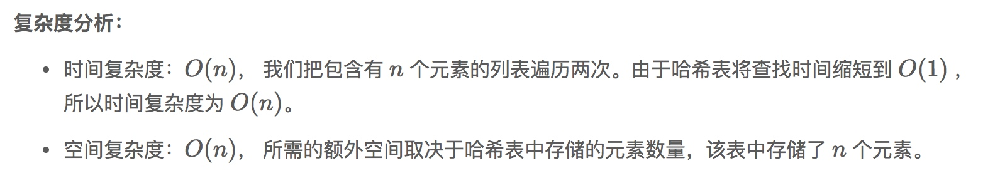
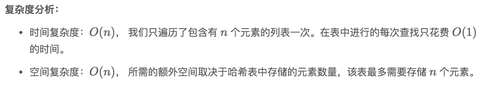

# 1.两数之和

### 方法1:暴力法


```
解题思路：
使用两个for循环，第一个循环从下标0开始，第二个循环从第一个循环的下标+1开始，这样可以使数组所有的元素两两组合，一一比对，是否符合条件！
```

``` swift
class Solution {

    func twoSum(_ nums: [Int], _ target: Int) -> [Int] {
        
        let count = nums.count
        for i in 0..<count {
            for j in (i+1)..<count{
                
                if nums[i] + nums[j] == target {
                    return [i,j];
                }
            }
        }
        return [];
    }
}

```


> 复杂度分析:
时间复杂度: O(n^2) 
空间复杂度: O(1).

==


### 方法2:两遍哈希表




``` swift
    func twoSum(_ nums: [Int], _ target: Int) -> [Int] {

        var dic = [Int:Int]()
        let count = nums.count;

        for i in 0..<count {
            dic[nums[i]] = i;
        }

        for i in 0..<count {
            let found = target - nums[i];
            if let j = dic[found], i != j {
                return [i,j]
            }
        }

        return []
    }
```




### 方法3:一遍哈希表

```
事实证明，我们可以一次完成。
在进行迭代并将元素插入到表中的同时，
我们还会回过头来检查表中是否已经存在当前元素所对应的目标元素。
如果它存在，那我们已经找到了对应解，并立即将其返回。
```

```swift
    func twoSum(_ nums: [Int], _ target: Int) -> [Int] {
        
        var dic = [Int:Int]()
        let count = nums.count;
        
        for i in 0..<count {
            let found = target - nums[i]
            if let j = dic[found] {
                return [i,j]
            }
            dic[nums[i]] = i;
        }
        
        return []
    }
```



